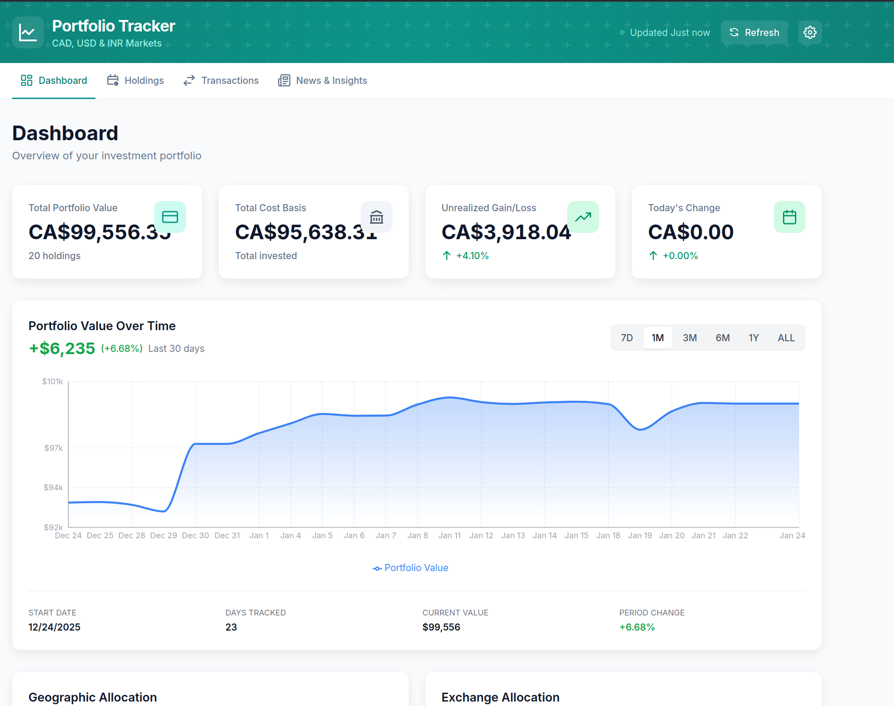

# Portfolio Tracker

Personal web application to track stock investments across Canadian (TSX, TSX-V), US (NASDAQ, NYSE), and Indian (NSE, BSE) markets.



## Features

- **Multi-Market Support**: Track stocks from TSX, NYSE, NASDAQ, NSE, BSE
- **Real-Time Prices**: Live updates via Yahoo Finance with 15-min caching
- **Transaction History**: Record BUY/SELL with automatic cost basis calculation
- **Portfolio Analytics**: Value tracking, gains/losses, allocation charts
- **Multi-Currency**: Automatic conversion between CAD, USD, INR

## Quick Start

### Option 1: Docker (Recommended)

```bash
git clone https://github.com/arniesaha/portfolio-tracker.git
cd portfolio-tracker
docker compose up -d --build
```

Open http://localhost:5173

### Option 2: Local Development

**Backend:**
```bash
cd backend
python -m venv venv
source venv/bin/activate
pip install -r requirements.txt
uvicorn app.main:app --reload
```

**Frontend:**
```bash
cd frontend
npm install
npm run dev
```

- Frontend: http://localhost:5173
- API Docs: http://localhost:8000/docs

## Tech Stack

| Layer | Technology |
|-------|------------|
| Backend | FastAPI, SQLAlchemy, SQLite |
| Frontend | React 18, Vite, TailwindCSS, Recharts |
| Data | yfinance, exchangerate-api.com |

## Project Structure

```
portfolio-tracker/
├── backend/           # FastAPI application
│   ├── app/
│   │   ├── models/    # SQLAlchemy models
│   │   ├── routers/   # API endpoints
│   │   ├── schemas/   # Pydantic schemas
│   │   └── services/  # Business logic
│   └── requirements.txt
├── frontend/          # React application
│   ├── src/
│   │   ├── components/
│   │   ├── pages/
│   │   ├── hooks/
│   │   └── services/
│   └── package.json
├── docs/              # Documentation
├── docker-compose.yml
└── data/              # SQLite database
```

## Documentation

- [Quick Start Guide](docs/QUICKSTART.md)
- [Deployment Guide](docs/DEPLOYMENT.md)
- [Troubleshooting](docs/TROUBLESHOOTING.md)
- [Project Specifications](docs/PROJECT.md)

## API Endpoints

| Endpoint | Description |
|----------|-------------|
| `GET /api/v1/holdings` | List all holdings |
| `POST /api/v1/holdings` | Create holding |
| `GET /api/v1/transactions` | List transactions |
| `POST /api/v1/transactions` | Record transaction |
| `GET /api/v1/portfolio/summary` | Portfolio overview |
| `GET /api/v1/analytics/allocation` | Allocation breakdown |
| `POST /api/v1/prices/refresh` | Refresh all prices |

Full API documentation available at http://localhost:8000/docs when running.

## License

Personal project. All rights reserved.
